# matechat — Design

Sequence diagrams for each use case.

**Participants:**
- **Client A / B** — any device running `matechat`
- **Broker** — the self-hosted Ubuntu server (directory + signaling + relay fallback)
- **CA** — family certificate authority (offline tool, not a running service)
- **SQLite** — local database on each client device (not on the broker)

The broker stores **no messages**. All history lives on client devices.

---

## 1. New device onboarding

The admin generates the family CA once, then issues one cert per device. Transfer is out-of-band (scp, USB, etc.).

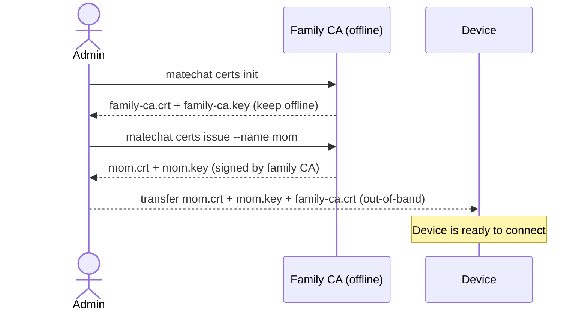

---

## 2. Client registers with broker

On startup, each client establishes an mTLS connection to the broker and registers its reachable address. The broker never stores messages — only the live peer directory.

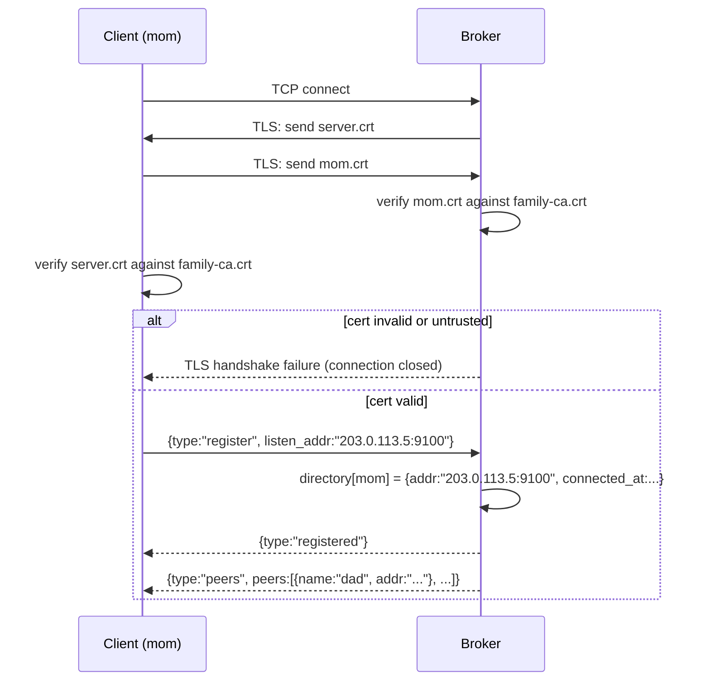

---

## 3. Peer discovery

Clients can query the broker at any time for the current list of online peers.

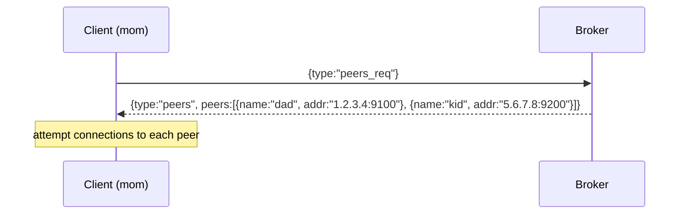

---

## 4. P2P connection — direct (happy path)

When a peer has a reachable public address, the client dials directly. The broker is not involved in message flow.

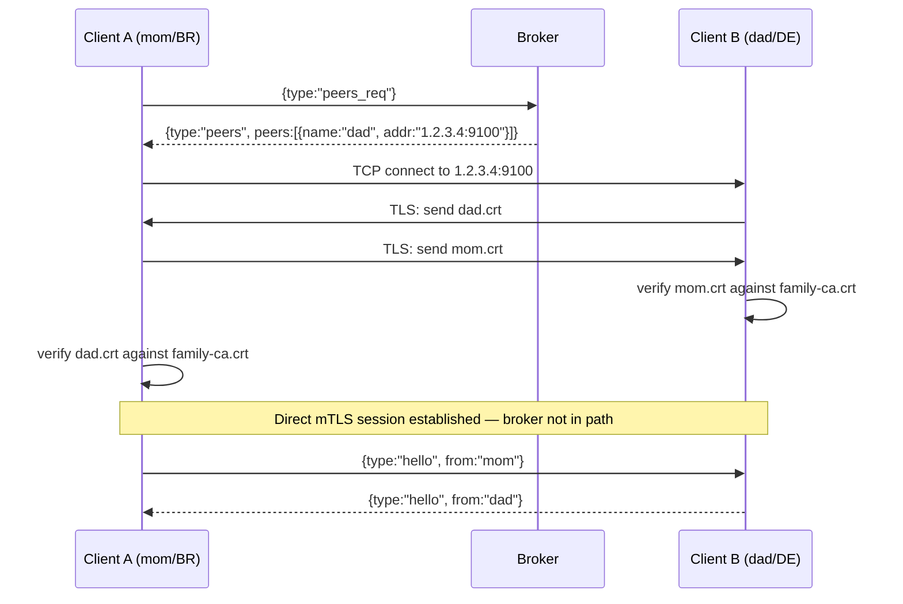

---

## 5. P2P connection — NAT hole punching

When both peers are behind NAT, the broker coordinates a simultaneous dial to punch through.

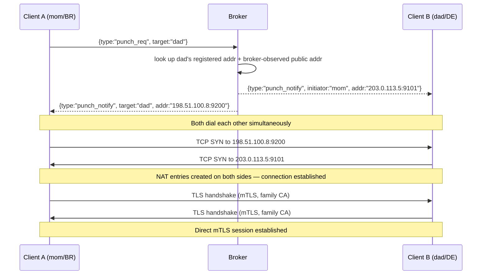

---

## 6. P2P connection — relay fallback

When direct dial and hole punching both fail (symmetric NAT, CGNAT), the broker relays encrypted frames. It forwards ciphertext only — it cannot decrypt the content.

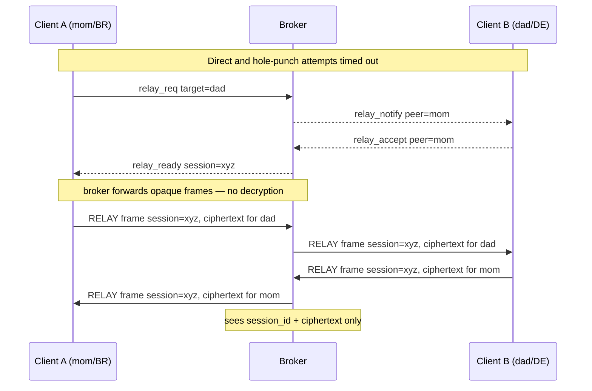

---

## 7. Send a message (P2P)

Messages travel directly between peers over the established mTLS session. Each recipient stores the message in their local SQLite.

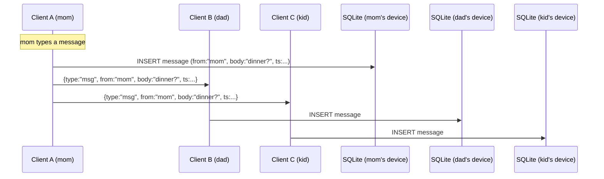

---

## 8. History sync on connect

When two peers connect, they exchange their latest message timestamps and sync any gaps. No broker involved.

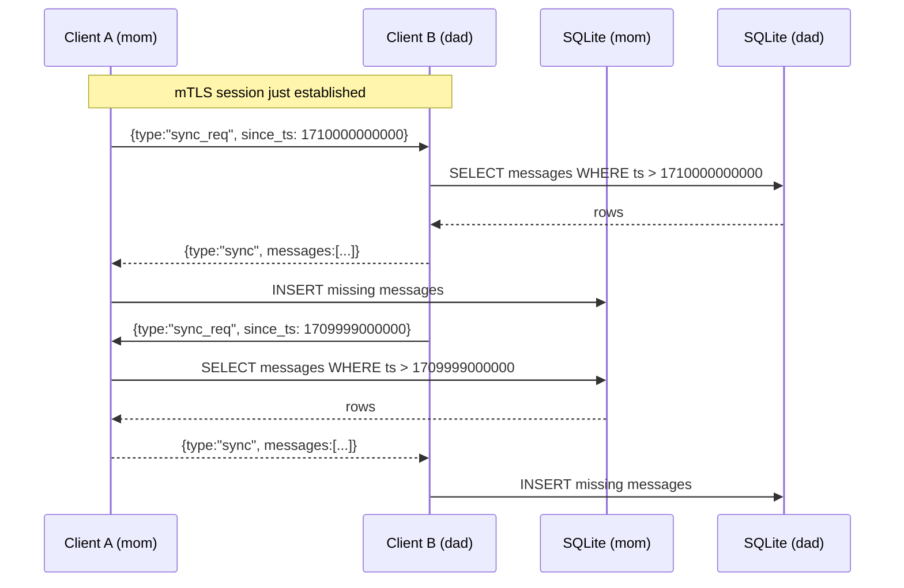

---

## 9. File transfer (P2P direct)

Files transfer directly between peers. No broker involvement — not even as relay unless the transport falls back. The sender notifies all peers; interested peers pull directly.

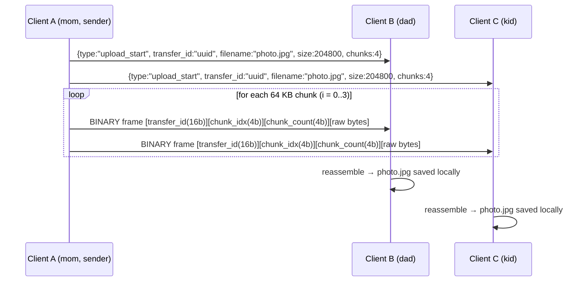

---

## 10. Graceful disconnect

Client notifies both the broker (to remove from directory) and all connected peers.

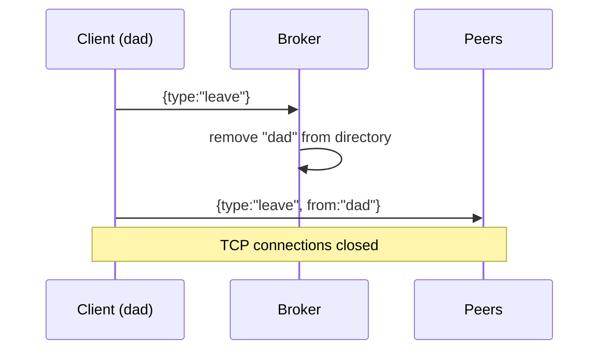

---

## 11. Unexpected disconnect (network drop)

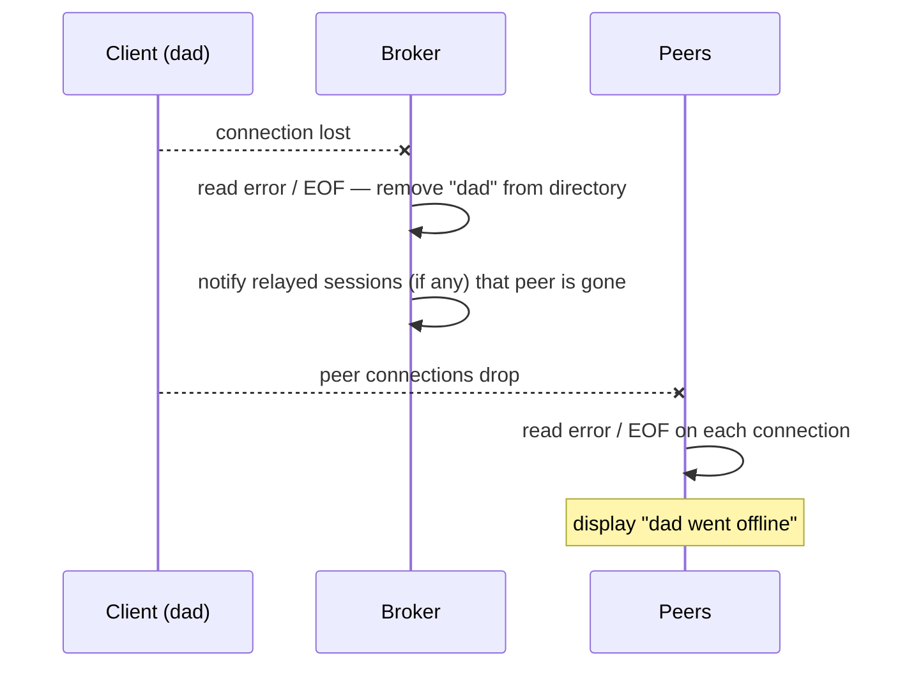

---

## 12. Access revocation

Revocation is enforced at the TLS handshake level. Existing sessions are not forcibly dropped (a broker restart evicts them if needed).

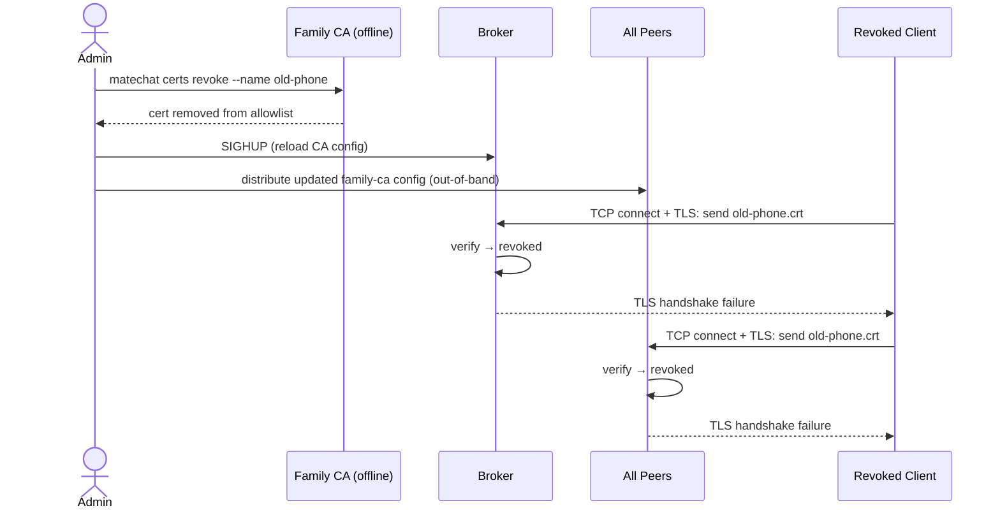

---

## Wire frame reference

### Client ↔ Broker protocol

```
Text frame: [4-byte BE uint32 length][0x01][JSON bytes]
```

| `type`           | Direction        | Key fields |
|------------------|------------------|------------|
| `register`       | client → broker  | `listen_addr` |
| `registered`     | broker → client  | |
| `peers`          | broker → client  | `peers[]{name, addr}` |
| `peers_req`      | client → broker  | |
| `punch_req`      | client → broker  | `target` |
| `punch_notify`   | broker → client  | `initiator` or `target`, `addr` |
| `relay_req`      | client → broker  | `target` |
| `relay_notify`   | broker → client  | `peer` |
| `relay_accept`   | client → broker  | `peer` |
| `relay_ready`    | broker → client  | `target`, `session_id` |
| `leave`          | client → broker  | |

### Client ↔ Client protocol

```
Text frame:   [4-byte BE uint32 length][0x01][JSON bytes]
Binary frame: [4-byte BE uint32 length][0x02][transfer_id: 16B][chunk_idx: 4B BE][chunk_count: 4B BE][raw bytes]
```

| `type`          | Direction         | Key fields |
|-----------------|-------------------|------------|
| `hello`         | client → client   | `from` |
| `msg`           | client → client   | `from`, `body`, `ts` |
| `sync_req`      | client → client   | `since_ts` |
| `sync`          | client → client   | `messages[]` |
| `upload_start`  | client → client   | `transfer_id`, `filename`, `size`, `chunks` |
| `leave`         | client → client   | `from` |

### Relay frames (via broker fallback)

```
[4-byte BE uint32 length][0x03][session_id: 16B][encrypted payload]
```

The payload is an opaque TLS record from the originating client's mTLS session. The broker forwards it without decryption.
